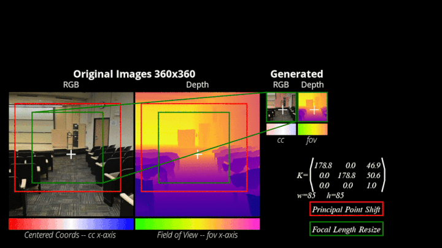

# CAM-Convs: Camera-Aware Multi-Scale Convolutions for Single-View Depth

Tensorflow implementation of CAM-Convs.

## Introduction
This repository contains original implementation of the [paper](http://openaccess.thecvf.com/content_CVPR_2019/papers/Facil_CAM-Convs_Camera-Aware_Multi-Scale_Convolutions_for_Single-View_Depth_CVPR_2019_paper.pdf): 'CAM-Convs: Camera-Aware Multi-Scale Convolutions for Single-View Depth' by Jose M. Facil ,Benjamin Ummenhofer, Huizhong Zhou, Luis Montesano, Thomas Brox* and Javier Civera*

<p align="center">

  
  </p>
The page of the paper is http://webdiis.unizar.es/~jmfacil/camconvs/

## Citing
Please cite CAM-Convs in your publications if it helps your research:
```bibtex
@InProceedings{Facil_2019_CVPR,
author = {Facil, Jose M. and Ummenhofer, Benjamin and Zhou, Huizhong and Montesano, Luis and Brox, Thomas and Civera, Javier},
title = {{CAM-Convs: Camera-Aware Multi-Scale Convolutions for Single-View Depth}},
booktitle = {The IEEE Conference on Computer Vision and Pattern Recognition (CVPR)},
month = {June},
year = {2019}
}
```

## Use Instructions
We recommend the use of a virtual enviroment for the use of this project. (*e.g.* [pew](https://github.com/berdario/pew))
```bash
$ pew new venvname -p python3 # replace venvname with your prefered name (it also works with python 2.7)
```
### Install Requirements
#### 1. This code has been compiled and tested using:
  - python3
  - cuda-10.0
  - cuDNN 7.5
  - TensorFlow 1.13
 
 You are free to try different configurations. But we do not ensure it had been tested.
#### 2. Install  python requirements:
  ```bash
  (venvname)$ pip install -r requirements.txt
  
  ```
#### 3. Compile lmbspecialops
Compile the submodule `lmbspecialops` following the instrucions [here](https://github.com/lmb-freiburg/lmbspecialops).
We recommend to simply run:
  ```bash
  (venvname)$ cd lmbspecialops
  (venvname)$ python setup.py install
  (venvname)$ pew add python
  (venvname)$ cd ..
  ```
Note: You may need to set the enviroment variable `LMBSPECIALOPS_LIB`
  ```bash
  (venvname)$ export LMBSPECIALOPS_LIB="/path/to/camconvs/lmbspecialops/build/lib.linux-x86_64-3.5/lmbspecialops.so" 
  ```
#### 4. Add python folder to the path:
  ```bash
  (venvname)$ pew add python/
  ```
#### 5. Try our Data Sampling and CAM-Conv Channels demo:
You can run the iPython Notebook and play with our Datawriter, Datareader and data augmentation operations to train CAM-Convs `ipython/DEMO_DATA_AUGMENTATION.ipynb`.
<p align="center">

  
  </p>
  
#### 6. Network code coming soon!
We are planning to add a second exaple including a Network training with multiple cameras. 
